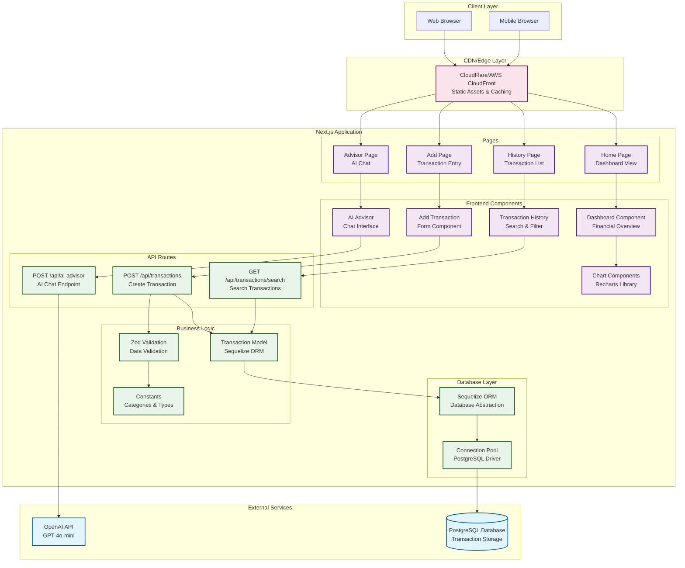

# SpendWise Application Architecture

## Overview
SpendWise is a Next.js-based personal finance management application that helps users track expenses, analyze spending patterns, and get AI-powered financial advice.

## Application Architecture Diagram

## Technology Stack

### Frontend
- **Framework**: Next.js 14 (App Router)
- **Language**: TypeScript
- **Styling**: Tailwind CSS
- **UI Components**: Custom components with Lucide React icons
- **Charts**: Recharts library
- **State Management**: React useState/useEffect

### Backend
- **Runtime**: Node.js
- **Framework**: Next.js API Routes
- **ORM**: Sequelize
- **Database Driver**: PostgreSQL (pg)
- **Validation**: Zod
- **AI Integration**: OpenAI API (GPT-4o-mini)

### Database
- **Primary Database**: PostgreSQL
- **Connection Pooling**: Sequelize built-in pooling
- **Schema**: Single table (transactions) with predefined categories

### External Services
- **AI Service**: OpenAI API for financial advice
- **Database**: PostgreSQL (can be hosted on AWS RDS, Google Cloud SQL, etc.)

## Key Features

### 1. Transaction Management
- Add income/expense transactions
- Categorize transactions (12 predefined categories)
- Form validation with Zod
- Real-time data persistence

### 2. Financial Analytics
- Dashboard with spending overview
- Category-based spending analysis (Pie Chart)
- Weekly spending trends (Bar Chart)
- Monthly financial trends (Area Chart)
- Savings goal tracking

### 3. AI Financial Advisor
- Conversational AI interface
- Context-aware financial advice
- Integration with OpenAI's GPT-4o-mini
- Conversation persistence

### 4. Transaction History
- Search and filter transactions
- Category and type filtering
- Summary statistics
- Pagination support

## Data Flow

1. **User Input**: Users interact with React components
2. **Validation**: Zod validates form data on both client and server
3. **API Processing**: Next.js API routes handle business logic
4. **Database Operations**: Sequelize ORM manages database interactions
5. **Response**: Data flows back through the same path
6. **UI Updates**: React components re-render with new data

## Security Considerations

- Input validation with Zod schemas
- SQL injection protection via Sequelize ORM
- Environment variable management for API keys
- CORS handling (Next.js built-in)
- Error handling and logging

## Scalability Considerations

- Connection pooling for database efficiency
- Static asset optimization via Next.js
- API route separation for microservice migration
- Stateless application design
- CDN integration for global performance

## Deployment Architecture (Future AWS Integration)

The application is designed to integrate with AWS services:
- **Frontend**: AWS S3 + CloudFront
- **Backend**: AWS Lambda + API Gateway
- **Database**: AWS RDS PostgreSQL
- **AI Service**: OpenAI API (external)
- **Monitoring**: AWS CloudWatch
- **CI/CD**: AWS CodePipeline
